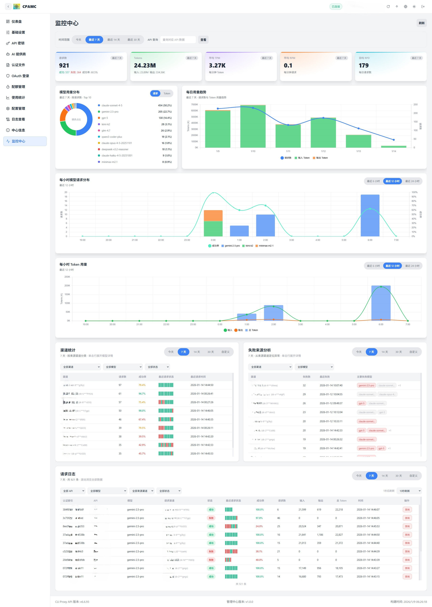

# CLI Proxy API 管理中心 (CPAMC)

> 一个基于官方仓库二次创作的 Web 管理界面

**[English](README_EN.md) | [中文](README.md)**

---

## 关于本项目

本项目是基于官方 [CLI Proxy API WebUI](https://github.com/router-for-me/Cli-Proxy-API-Management-Center) 进行开发的日志监控和数据可视化管理界面

### 与官方版本的区别

本版本与官方版本其他功能保持一致，主要差异在于**新增监控中心**，对日志分析和查看的增强

### 界面预览

管理界面展示



---

## 快速开始

### 使用本管理界面

在你的 `config.yaml` 中修改以下配置：

```yaml
remote-management:
  panel-github-repository: "https://github.com/kongkongyo/Cli-Proxy-API-Management-Center"
```

配置完成后，重启 CLI Proxy API 服务，访问 `http://<host>:<api_port>/management.html` 即可查看管理界面

详细配置说明请参考官方文档：https://help.router-for.me/cn/management/webui.html

---

## 主要功能

### 监控中心 - 核心新增功能

这是本管理界面相对于官方版本的唯一新增功能，提供了全方位的数据可视化和监控能力

> 注意：CLI Proxy API 主程序目前没有数据持久化功能，重启程序后统计数据会丢失。需要先通过 API 使用相关服务产生数据后，才能在监控中心看到统计信息。

#### KPI 指标仪表盘

实时展示核心运营指标，支持按时间范围筛选：
- **请求数**：总请求数、成功/失败统计、成功率百分比
- **Token 数**：总 Token 数、输入 Token、输出 Token
- **平均 TPM**：每分钟 Token 使用量
- **平均 RPM**：每分钟请求数
- **日均 RPD**：日均请求数

所有指标都会根据选择的时间范围（今天/7天/14天/30天）动态计算，实时更新

#### 模型用量分布

直观的饼图展示不同模型的使用占比：
- 按请求数分布
- 按 Token 数分布
- 可切换查看请求占比或 Token 占比

#### 每日趋势分析

详细的时间序列图表，展示每日用量变化趋势：
- 请求数趋势曲线
- 输入 Token 趋势
- 输出 Token 趋势
- 思考 Token 趋势（如支持）
- 缓存 Token 趋势

#### 每小时分析

两个详细的小时级图表，帮助定位高峰时段：

**每小时模型请求分布**
- 柱状图展示不同模型在各小时的请求数
- 支持最近 6 小时/12 小时/24 小时/全部视图切换

**每小时 Token 用量**
- 堆叠柱状图展示 Token 使用构成
- 区分输入 Token、输出 Token、思考 Token、缓存 Token

#### 渠道统计

详细表格展示各渠道（API Key/模型）的使用情况：
- 可按全部渠道/特定渠道筛选
- 可按全部模型/特定模型筛选
- 可按全部状态/仅成功/仅失败筛选
- 显示渠道名称、请求数、成功率
- 点击展开查看该渠道下各模型的详细统计
- 显示最近请求状态（最近 10 次请求的迷你状态条）
- 最近请求时间

#### 失败来源分析

帮助定位问题渠道和模型：
- 按渠道统计失败次数
- 显示最近失败时间
- 列出主要失败的模型
- 点击展开查看该渠道下所有失败的请求详情

#### 请求日志 - 高级功能

功能强大的请求日志表格，支持海量数据流畅浏览

**多维度筛选**
- 按 API Key 筛选
- 按提供商类型筛选（OpenAI/Gemini/Claude 等）
- 按模型名称筛选
- 按来源渠道筛选
- 按请求状态筛选（全部/成功/失败）

**独立时间范围**
- 支持今天/7天/14天/30天/自定义日期范围
- 与主页面时间范围独立控制

**虚拟滚动**
- 支持 10 万+ 条日志流畅浏览
- 显示当前可见范围统计
- 性能优化，只渲染可见行

**智能信息展示**
- 自动匹配 API Key 到提供商名称（基于配置信息）
- 完整的渠道信息（提供商名称 + 掩码后的密钥）
- 请求类型/模型名称/请求状态
- 最近 10 次请求的状态可视化（绿点=成功，红点=失败）
- 成功率百分比
- 总请求数/输入 Token/输出 Token/总 Token
- 请求时间（完整时间戳）

**自动刷新**
- 支持手动刷新 / 5秒 / 10秒 / 15秒 / 30秒 / 60秒 自动刷新
- 倒计时显示下次刷新时间
- 独立数据加载，不阻塞主页面

**一键禁用模型**
- 支持直接在日志中禁用某渠道的某个模型
- 只对支持该操作的渠道类型生效
- 不支持时显示提示和手动操作指南

---

## 官方版本功能

以下功能与官方版本一致，通过改进的界面提供更好的使用体验

### 仪表盘
- 连接状态实时监控
- 服务器版本和构建信息一目了然
- 使用数据快速概览，掌握全局
- 可用模型统计

### API 密钥管理
- 添加、编辑、删除 API 密钥
- 管理代理服务认证

### AI 提供商配置
- **Gemini**：API 密钥管理、排除模型、模型前缀
- **Claude**：API 密钥和配置、自定义模型列表
- **Codex**：完整配置管理（API 密钥、Base URL、代理）
- **Vertex**：模型映射配置
- **OpenAI 兼容**：多密钥管理、模型别名导入、连通性测试
- **Ampcode**：上游集成和模型映射

### 认证文件管理
- 上传、下载、删除 JSON 认证文件
- 支持多种提供商（Qwen、Gemini、Claude 等）
- 搜索、筛选、分页浏览
- 查看每个凭证支持的模型

### OAuth 登录
- 一键启动 OAuth 授权流程
- 支持 Codex、Anthropic、Gemini CLI、Qwen、iFlow 等
- 自动保存认证文件
- 支持远程浏览器回调提交

### 配额管理
- Antigravity 额度查询
- Codex 额度查询（5 小时、周限额、代码审查）
- Gemini CLI 额度查询
- 一键刷新所有额度

### 使用统计
- 请求/Token 趋势图表
- 按模型和 API 的详细统计
- RPM/TPM 实时速率
- 缓存和推理 Token 分解
- 成本估算（支持自定义价格）

### 配置管理
- 在线编辑 `config.yaml`
- YAML 语法高亮
- 搜索和导航
- 保存和重载配置

### 日志查看
- 实时日志流
- 搜索和过滤
- 自动刷新
- 下载错误日志
- 屏蔽管理端流量

### 中心信息
- 连接状态检查
- 版本更新检查
- 可用模型列表展示
- 快捷链接入口

---

## 连接说明

### API 地址格式

以下格式都可以，系统会自动识别

```
localhost:8317
http://192.168.1.10:8317
https://example.com:8317
```

### 管理密钥

管理密钥是验证管理操作的钥匙，和客户端使用的 API 密钥不一样

### 远程管理

从非本地浏览器访问的时候，需要在服务器启用远程管理（`allow-remote-management: true`）

---

## 界面特性

### 主题切换
- 亮色模式
- 暗色模式
- 跟随系统

### 语言支持
- 简体中文
- English

### 响应式设计
- 桌面端完整功能
- 移动端适配体验
- 侧边栏可折叠

---

## 常见问题

**Q: 如何使用这个自定义 UI？**

A: 在 CLI Proxy API 的配置文件中添加以下配置即可
```yaml
remote-management:
  panel-github-repository: "https://github.com/kongkongyo/CLIProxyAPI-Web-Dashboard"
```

**Q: 无法连接到服务器？**

A: 请检查以下内容
- API 地址是否正确
- 管理密钥是否正确
- 服务器是否启动
- 远程访问是否启用

**Q: 日志页面不显示？**

A: 需要去"基础设置"里开启"日志记录到文件"功能

**Q: 某些功能显示"不支持"？**

A: 可能是服务器版本太旧，升级到最新版本的 CLI Proxy API

**Q: OpenAI 提供商测试失败？**

A: 测试是在浏览器端执行的，可能会受到 CORS 限制，失败不一定代表服务器端不能用

**Q: 这个版本和官方版本有什么区别？**

A: 主要区别有两个：
1. **界面风格**：全新的视觉设计，UI 细节更精致
2. **监控中心**：这是唯一新增的功能模块，提供了强大的数据可视化和监控能力，包括 KPI 仪表盘、模型用量分布、趋势分析、小时级图表、渠道统计、失败分析和高级请求日志等功能

其他所有功能与官方版本保持一致

---

## 相关链接

- **官方主程序**: https://github.com/router-for-me/CLIProxyAPI
- **官方 WebUI**: https://github.com/router-for-me/Cli-Proxy-API-Management-Center
- **本仓库**: https://github.com/kongkongyo/CLIProxyAPI-Web-Dashboard

## 许可证

MIT License
